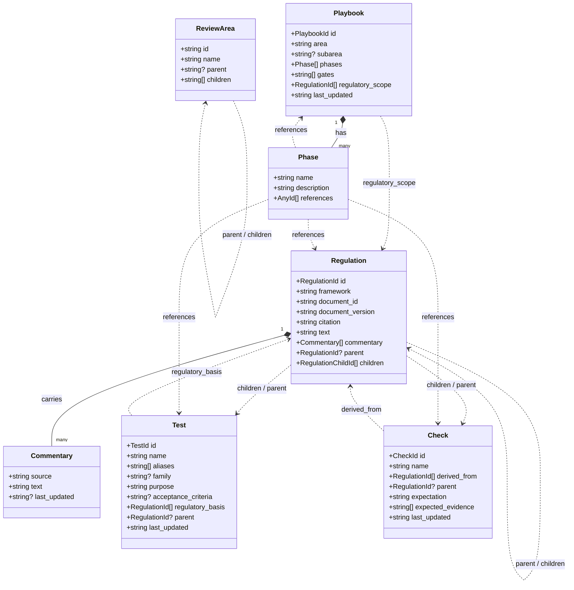
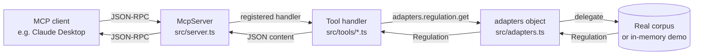

# Architecture

Three views: the surface map (how the content surfaces reference each other — sources sit outside the reference graph, joined to regulation by `document_id` instead), the schema (every field on every type), and the request lifecycle (what happens when a client calls a tool).

## Surface map

The four content surfaces and what each one carries:

| Surface | Example ID | Distinguishing fields |
|---|---|---|
| Regulation | `regulation://crr/178/1/a` | Versioned (`document_version`, `as_of`); inline `commentary[]`; `parent` / `children` for nesting plus attached checks and tests |
| Test | `test://jeffreys` | Statistical test described, never run; `family` + `aliases` enable equivalence; `acceptance_criteria` is the pass bar |
| Check | `check://calibration/pd/lra-derived` | Qualitative pass/fail expectation; traced to law via `derived_from`; `expected_evidence[]` for reviewers |
| Playbook | `playbook://calibration/pd` | `phases[]` with mixed references; `gates[]` between phases; `regulatory_scope` at the top level |

The typed edges between them:

| From | Field | To |
|---|---|---|
| Check | `derived_from` | Regulation |
| Test | `regulatory_basis` | Regulation |
| Playbook | `regulatory_scope` | Regulation |
| Playbook | `phases[].references` | Regulation, Test, Check, Playbook |
| Regulation | `parent` / `children` | Regulation (nesting), plus Check and Test |

Every one of those is enforced at compile time — `Check.derived_from: RegulationId[]` rejects a `TestId` before the program runs, and `Regulation.children: RegulationChildId[]` rejects a `PlaybookId`. Sources sit outside this graph entirely: nothing points at a `SourceId`, and the join to regulation is `framework` + `document_id` string equality.

## Schema relationships

```mermaid
classDiagram
    class Regulation {
        +RegulationId id
        +string framework
        +string document_id
        +string document_version
        +string citation
        +string text
        +Commentary[] commentary
        +RegulationId? parent
        +RegulationChildId[] children
    }

    class Commentary {
        +string source
        +string text
        +string? last_updated
    }

    class Test {
        +TestId id
        +string name
        +string[] aliases
        +string? family
        +string purpose
        +string? acceptance_criteria
        +RegulationId[] regulatory_basis
        +RegulationId? parent
        +string last_updated
    }

    class Check {
        +CheckId id
        +string name
        +RegulationId[] derived_from
        +RegulationId? parent
        +string expectation
        +string[] expected_evidence
        +string last_updated
    }

    class Playbook {
        +PlaybookId id
        +string area
        +string? subarea
        +Phase[] phases
        +string[] gates
        +RegulationId[] regulatory_scope
        +string last_updated
    }

    class Phase {
        +string name
        +string description
        +AnyId[] references
    }

    class ReviewArea {
        +string id
        +string name
        +string? parent
        +string[] children
    }

    Regulation "1" *-- "many" Commentary : carries
    Playbook "1" *-- "many" Phase : has
    Regulation ..> Regulation : parent / children
    Regulation ..> Check : children / parent
    Regulation ..> Test : children / parent
    Check ..> Regulation : derived_from
    Test ..> Regulation : regulatory_basis
    Playbook ..> Regulation : regulatory_scope
    Phase ..> Regulation : references
    Phase ..> Test : references
    Phase ..> Check : references
    Phase ..> Playbook : references
    ReviewArea ..> ReviewArea : parent / children
```

The dashed arrows are cross-surface references — the places where template literal types catch wrong-surface IDs at compile time. The computed types (`CorpusInfo`, `Referrers`) are derived at query time, not stored, so they're omitted here — see the [Schema reference](/corpus/schemas) for their full shape.

## Request lifecycle

A single `get_regulation` call, from client to corpus and back. The seam is the `adapters` object — defaults return empty, the in-memory demo seeds maps, a production deployment points at a real corpus.

```mermaid
flowchart LR
    Client[MCP client<br/>e.g. Claude Desktop]
    Server[McpServer<br/>src/server.ts]
    Tools[Tool handler<br/>src/tools/*.ts]
    Adapters[adapters object<br/>src/adapters.ts]
    Backend[(Real corpus<br/>or in-memory demo)]

    Client -->|JSON-RPC| Server
    Server -->|registered handler| Tools
    Tools -->|adapters.regulation.get| Adapters
    Adapters -->|delegate| Backend
    Backend -->|Regulation| Adapters
    Adapters -->|Regulation| Tools
    Tools -->|JSON content| Server
    Server -->|JSON-RPC| Client
```

The `adapters` object is the seam. Default implementations return empty; `examples/inmemory-demo.ts` reassigns the handles to seed in-memory data, and a backend adapter would do the same against its own storage.

## Where the boundaries are

| Concern | Lives where |
|---|---|
| Tool/resource/prompt registration | `src/server.ts` |
| Per-surface tool handlers | `src/tools/{regulation,tests,checks,playbooks,sources}.ts` |
| Cross-cutting tools | `src/tools/meta.ts` |
| Adapter interfaces + handle object | `src/adapters.ts` |
| Schemas (zod + template literal types) | `src/schema.ts` |
| Prompt scaffolds | `src/prompts/` |
| Reference adapter for development | `examples/inmemory-demo.ts` |

The schema file is upstream of everything else — `src/server.ts`, the tool handlers, and the adapters all import from it. Changes there ripple, by design.
